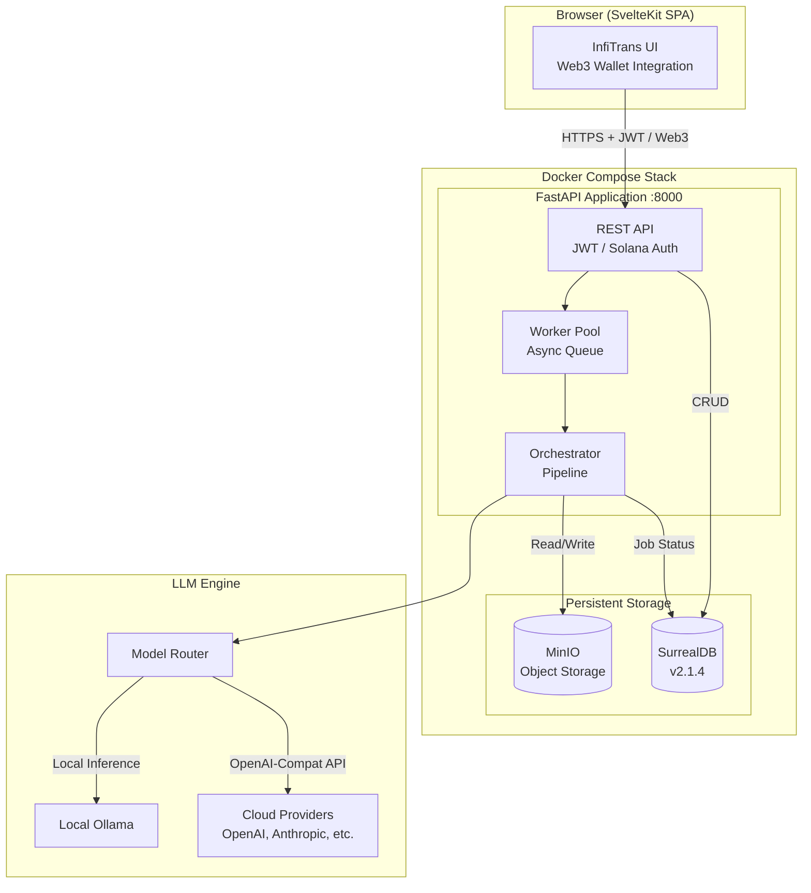
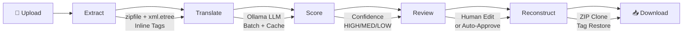

<p align="center">
  
</p>

<h1 align="center">InfiTrans</h1>

<p align="center">
  <strong>Enterprise Document Translation Platform</strong><br>
  <em>by <a href="mailto:office@infiniteagentlabs.com">Infinite Agent Lab</a></em>
</p>

<p align="center">
  Multi-Model LLM Routing · Solana Web3 Auth · 15+ Languages · Format-Preserving
</p>

---

## Overview

InfiTrans is an enterprise-grade document translation platform designed for security, accuracy, and scale. Initially built for air-gapped local LLMs, InfiTrans now features a **Multi-Model Routing Engine** capable of dispatching translation workloads to OpenRouter, OpenAI, Anthropic, Gemini, or local Ollama instances based on language pair and domain.

### Key Highlights

- **Multi-Model LLM Routing** — Dynamically route tasks (e.g., `ja->vi` to Claude 3.5, and `en->zh` to GPT-4o) via OpenAI-compatible endpoints.
- **Enterprise Billing & Web3 Auth** — Integrated Solana Pay for seamless, decentralized enterprise billing and wallet-based authentication.
- **Air-Gapped Ready** — Fully supports 100% local inference via Ollama for zero-trust environments.
- **15+ Languages & 7 Domains** — Auto-detect source + translate to 15+ languages across Legal, IT, Medical, Finance, and more.
- **Format-Preserving** — Translates DOCX, XLSX, PPTX, PDF, CSV, TXT, MD while preserving 100% of the original formatting.
- **XLIFF Exchange** — Dual-version (1.2 + 2.1) export/import for CAT tool workflows.
- **Human-in-the-Loop** — Confidence scoring + in-app bilingual review editor.

---

## System Architecture



### Translation Pipeline (5 Phases)



| Phase | Engine | What It Does |
|:------|:-------|:-------------|
| **Extract** | `zipfile` + `xml.etree` | Walk XML trees, build inline-tag strings `<tagX>` → `segments[]` |
| **Translate** | Multi-Model Router | Route to best LLM (Local/Cloud) based on `MODEL_{SRC}_{TGT}` rules |
| **Score** | Multi-signal heuristic | Confidence scoring (HIGH/MEDIUM/LOW) per segment |
| **Review** | Web Editor / XLIFF | In-app bilingual editing or CAT tool roundtrip |
| **Reconstruct** | Deterministic Python | ZIP clone → replace text → format-preserved output |

---

## Supported Languages (15)

| Language | Code | Language | Code |
|:---------|:-----|:---------|:-----|
| Japanese | `ja` | Thai | `th` |
| Vietnamese | `vi` | Indonesian | `id` |
| Chinese (Simplified) | `zh` | Russian | `ru` |
| Chinese (Traditional) | `zh-TW` | Portuguese | `pt` |
| Korean | `ko` | Arabic | `ar` |
| English | `en` | Hindi | `hi` |
| French | `fr` | — | — |
| German | `de` | — | — |
| Spanish | `es` | — | — |

Source language supports **Auto Detect** mode using Unicode block analysis (CJK, Hiragana, Katakana, Hangul, Arabic, Devanagari, Thai, Cyrillic).

---

## Supported Formats

| Format | Extraction Strategy | Reconstruction Strategy |
|:-------|:-------------------|:-----------------------|
| **DOCX** | `word/document.xml` + headers/footers/endnotes `<w:p>` aggregation | Non-destructive ZIP clone + inline tag restore |
| **XLSX** | `xl/sharedStrings.xml` + worksheets + drawings + sheet names | Byte-level surgery: sheet rename, formula ref update, calcChain drop |
| **PPTX** | `ppt/slides/slide*.xml` `<a:p>` aggregation | Non-destructive ZIP clone + inline tag restore |
| **TXT/MD** | Line-by-line + diagram token extraction | Line replacement + ASCII art grid expansion |
| **CSV** | Cell-by-cell scan | Cell replacement |
| **PDF** | Text extraction (read-only) | *(reconstruction not yet implemented)* |

---

## Quick Start

### Prerequisites

- Docker + Docker Compose
- Ollama (with model pulled)
- 8GB+ RAM (for 1.8B model) or 16GB+ (for larger models)

### 1. Configure Environment

```bash
cp .env.example .env
# Edit .env — defaults work for most setups
```

### 2. Pull Translation Model

```bash
ollama pull gemma4:31b-cloud
```

### 3. Start Services

```bash
docker compose up -d --build
```

### 4. Access UI

Open [http://localhost:8000](http://localhost:8000)

Default credentials:
- Username: `infitrans_test`
- Password: `InfiTest2026!`

### 5. CLI Usage (Alternative)

```bash
cd backend && pip install -r requirements.txt

# Basic translation
python scripts/cli.py translate --file doc.docx
# Specify language pair
python scripts/cli.py translate --file doc.docx --source ja --target vi
# Export XLIFF for external review
python scripts/cli.py translate --file doc.docx --export-xliff --xliff-version 2.1
# Interactive terminal review
python scripts/cli.py review data/output/doc_vi.xlf
# Reconstruct document from XLIFF
python scripts/cli.py translate --file doc.docx --import-xliff data/output/doc_vi.xlf
```

---

## Configuration

All settings via environment variables. Priority: **env vars > .env file > defaults**.

### Core Settings

| Variable | Default | Description |
|:---------|:--------|:------------|
| `OLLAMA_URL` | `http://ollama:11434` | Ollama API endpoint |
| `OLLAMA_TIMEOUT` | `1800` | Request timeout (seconds) |
| `MODEL` | `gemma4:31b-cloud` | Translation LLM model |
| `SOURCE_LANG` | `auto` | Default source language |
| `TARGET_LANG` | `en` | Default target language |
| `DEFAULT_DOMAIN` | `general` | Default translation domain |

### LLM Inference

| Variable | Default | Description |
|:---------|:--------|:------------|
| `TRANSLATION_TEMPERATURE` | `0.7` | Sampling temperature |
| `TOP_K` | `20` | Top-K sampling |
| `TOP_P` | `0.6` | Nucleus sampling |
| `REPETITION_PENALTY` | `1.05` | Repetition penalty |
| `TRANSLATION_NUM_CTX` | `4096` | Context window size |
| `OLLAMA_THINK` | `false` | Enable CoT reasoning mode |

### Extraction & Batching

| Variable | Default | Description |
|:---------|:--------|:------------|
| `MAX_INLINE_TAGS` | `8` | Max tags before stripping |
| `MAX_SEGMENT_CHARS` | `400` | Max chars per segment |
| `BATCH_MAX_CHARS` | `3000` | Max chars per LLM batch |
| `BATCH_MAX_SEGMENTS` | `5` | Max segments per batch |
| `MAX_CONCURRENT_BATCHES` | `2` | Parallel batches |

### Security

| Variable | Default | Description |
|:---------|:--------|:------------|
| `SECRET_KEY` | *(must change)* | JWT signing secret |
| `STORAGE_ENCRYPTION_KEY` | *(optional)* | SSE-C encryption key (base64, requires HTTPS) |
| `FILE_RETENTION_DAYS` | `14` | Auto-delete files after N days |

---

## API Endpoints

| Method | Endpoint | Auth | Description |
|:-------|:---------|:-----|:------------|
| POST | `/api/auth/register` | — | Register new user |
| POST | `/api/auth/login` | — | Login (returns JWT) |
| POST | `/api/upload` | JWT | Upload document for translation |
| GET | `/api/jobs` | JWT | List recent jobs |
| GET | `/api/jobs/{id}` | JWT | Get job detail |
| GET | `/api/download/{id}` | JWT | Download translated file |
| GET | `/api/download/{id}?xliff=true` | JWT | Download XLIFF |
| POST | `/api/glossary/upload` | JWT | Upload CSV glossary |
| GET | `/api/glossary` | JWT | List glossary terms |
| DELETE | `/api/glossary/{id}` | JWT | Delete term |
| GET | `/api/languages` | — | List supported languages |
| GET | `/api/domains` | — | List supported domains |
| GET | `/api/health` | — | Health check |

---

## Project Structure

```
infitrans/
├── frontend/                     # SvelteKit SPA + Paraglide i18n
│   ├── src/
│   │   ├── lib/
│   │   │   ├── components/           # UI components (7 Svelte + SVG icons)
│   │   │   ├── stores/               # Reactive state (config, i18n)
│   │   │   └── api.ts                # Centralized API client
│   │   └── routes/
│   │       ├── (marketing)/          # Landing page (public)
│   │       ├── (auth)/               # Login / Register / Forgot Password
│   │       └── (app)/                # Translate workspace (protected)
│   └── messages/                     # i18n JSON (en, vi, ja)
├── backend/
│   ├── app/
│   │   ├── agent/                    # Translation pipeline core
│   │   │   ├── orchestrator.py           # Pipeline coordinator
│   │   │   ├── extractor.py              # Text extraction (Native OOXML)
│   │   │   ├── translator.py             # LLM batch translation + cache
│   │   │   ├── reconstructor/            # Format-preserving reconstruction
│   │   │   │   ├── docx.py / xlsx.py / pptx.py / plaintext.py
│   │   │   │   ├── _ooxml.py             # Shared OOXML utilities
│   │   │   │   └── _common.py            # Translation map builder
│   │   │   ├── confidence.py             # Confidence scoring
│   │   │   ├── prompt_router.py          # Domain/language prompt router
│   │   │   └── xliff.py                  # XLIFF 1.2/2.1 export/import
│   │   ├── llm/                      # LLM abstraction layer
│   │   │   ├── base.py                   # Abstract LLMClient
│   │   │   ├── factory.py                # Backend factory (Ollama/Cloud)
│   │   │   ├── model_router.py           # Tiered multi-model resolution
│   │   │   └── openai_compat.py          # Universal OpenAI API client
│   │   ├── ollama/                   # Ollama HTTP client
│   │   ├── prompts/                  # Prompt engineering resources
│   │   │   ├── rules/formats/            # OOXML / plaintext rules
│   │   │   └── skills/
│   │   │       ├── languages/source/     # 15 source language prompts
│   │   │       ├── languages/target/     # 15 target language prompts
│   │   │       └── domains/              # 7 domain prompts
│   │   ├── routes/                   # Admin, Billing, Wallet Auth, Jobs
│   │   ├── utils/                    # Language detection, file detect
│   │   ├── auth.py                   # JWT + Wallet Auth
│   │   ├── config.py                 # Environment settings
│   │   ├── database.py               # SurrealDB async client
│   │   ├── storage.py                # MinIO object storage
│   │   └── worker.py                 # Async job worker pool
│   └── tests/                        # Unit + integration tests
├── docs/                             # Architecture maps & guidelines
├── scripts/                          # Utility scripts
│   ├── cli.py                        # Unified CLI tool
│   └── i18n_manager.py               # Frontend translation sync
├── docker-compose.yml                # Docker deployment
├── Dockerfile                        # Multi-stage build (Node + Python)
└── .env.example                      # Configuration template
```

---

## Translation Quality Controls

| Control | Implementation |
|:--------|:---------------|
| Language-aware prompts | Per-source/target language prompt rules with linguistic guidance |
| Domain-aware prompts | Per-domain terminology and style rules |
| Inline Tag preservation | Trados-style `<tagX>` serialization in LLM system prompt |
| Tag Validator (RALPH Loop) | Regex catches missing/hallucinated tags, triggers automated retry |
| Source Leak Detector | Unicode regex detects untranslated source text, triggers 1-by-1 retry |
| Count Mismatch Fallback | Auto-retries 1-by-1 if batch response has wrong segment count |
| Translation Cache | SurrealDB cache — clean translations skip LLM on subsequent encounters |
| Glossary Enforcement | User-defined terms injected as mandatory translation table |
| Confidence Scoring | Multi-signal heuristic → HIGH/MEDIUM/LOW triage |
| In-App Review | Web bilingual editor + CLI for editing before reconstruction |
| XLIFF Roundtrip | Edit in Trados/memoQ → re-import → reconstruct |

---

## Tech Stack

| Layer | Technology |
|:------|:-----------|
| Frontend | SvelteKit 2 + Paraglide-JS (i18n) + TypeScript |
| Backend | FastAPI + Python 3.13 + asyncio |
| LLM | Ollama + gemma4:31b-cloud (31B params) |
| Database | SurrealDB v2.1.4 |
| Object Storage | MinIO (S3-compatible) |
| Auth | JWT + bcrypt (native, no passlib) |
| Deployment | Docker Compose (multi-stage build) |

---

## License

**Dual-licensing strategy:**

**1. Open Source (Free):** Licensed under [GNU AGPL v3.0](LICENSE). You may use, learn from, and modify this code. If you distribute or provide it as a network service, you **must** release your entire product's source code under AGPL v3.0.

**2. Commercial (Paid):** For closed-source commercial use without AGPL obligations, purchase a Commercial License.

Contact: `office@infiniteagentlabs.com`

---

<p align="center">
  <strong>Infinite Agent Lab</strong> · Building the future of local AI
</p>
