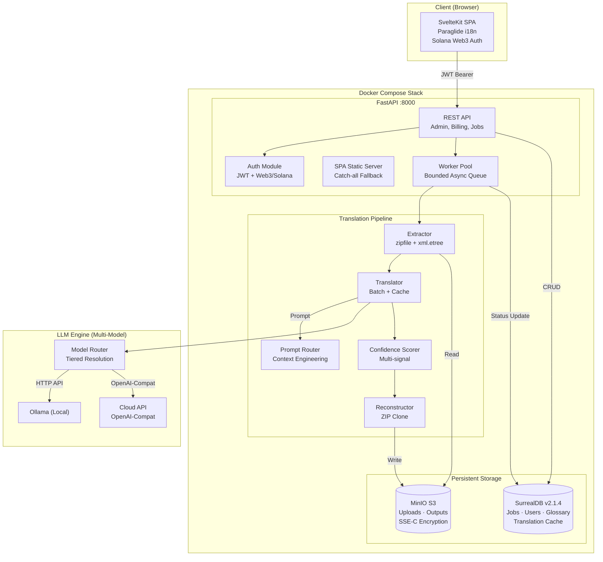
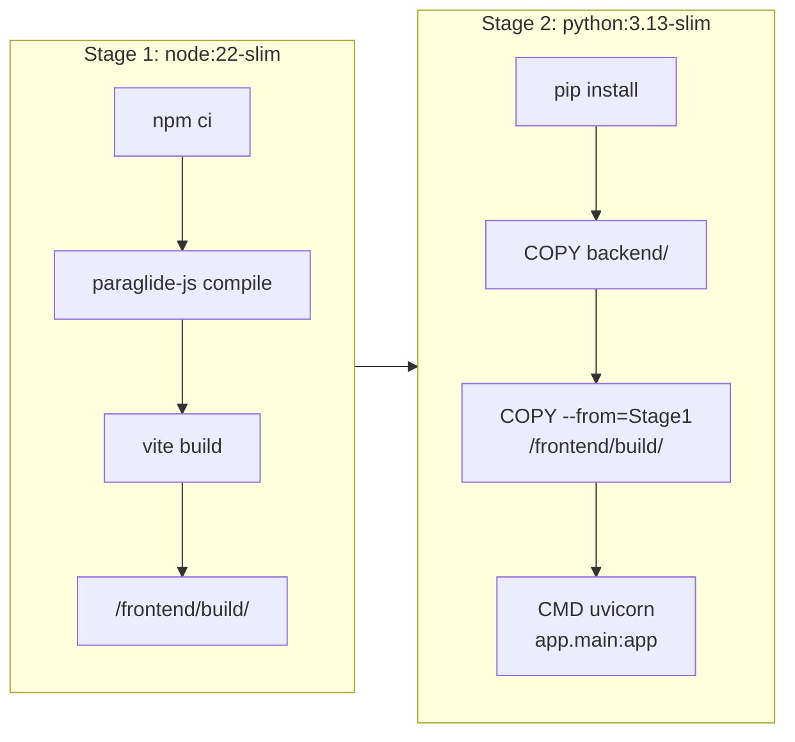
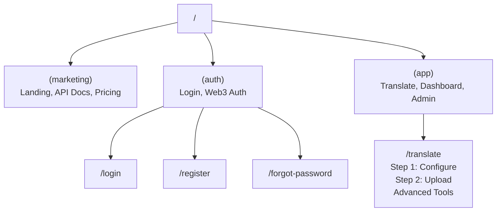
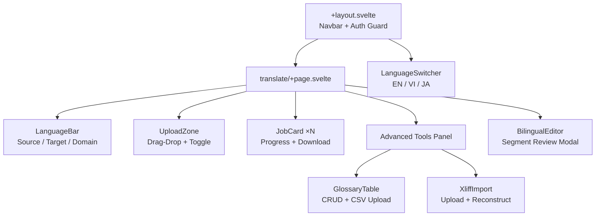
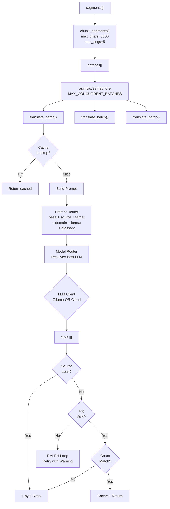
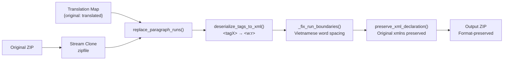
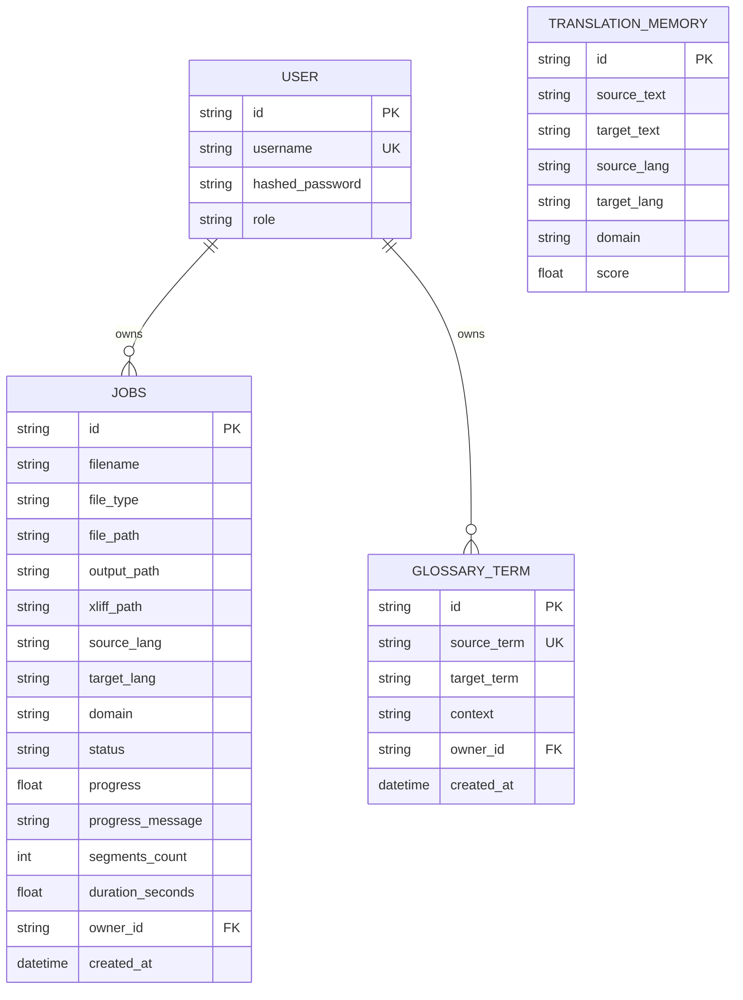
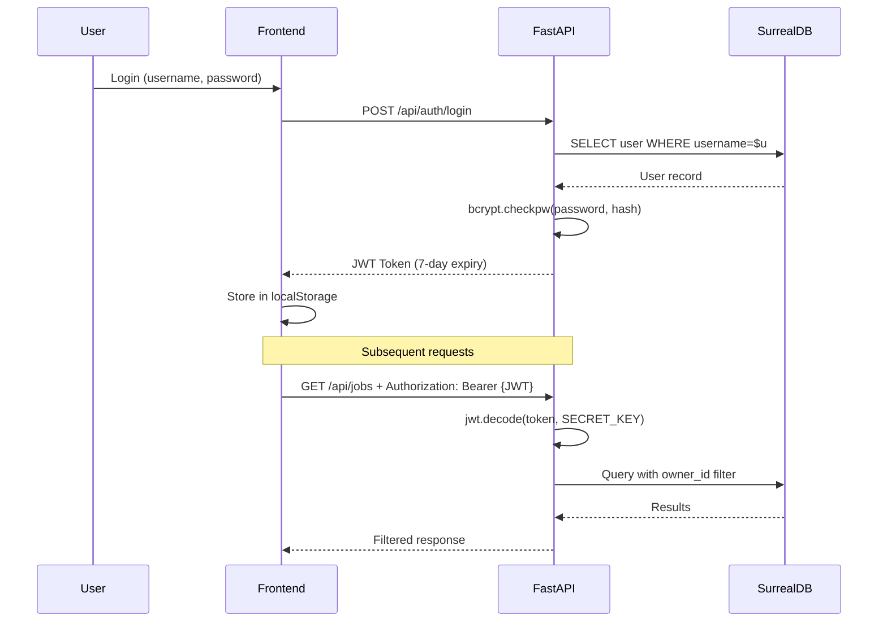
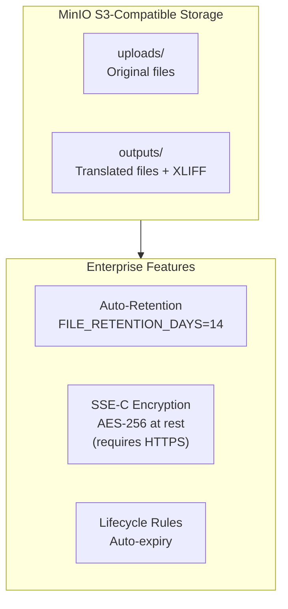

# Architecture Deep-Dive

> InfiTrans — Enterprise Document Translation Platform  
> Deterministic Extract → Translate → Score → Review → Reconstruct Pipeline

---

## 1. System Overview



### Docker Build Pipeline



### Configuration Flow

```
Environment Variables  ─→  os.environ  ─→  config.py Settings singleton
         ↑                                        ↓
   docker-compose.yml                     All modules import
   environment: block                     from app.config import settings
         ↑
   .env file (loaded by
   custom _load_dotenv)
```

Priority: **env vars > docker-compose environment > .env file > built-in defaults**

---

## 2. Frontend Architecture

### Technology Stack

| Technology | Purpose |
|:-----------|:--------|
| **SvelteKit 2** | Component framework + file-based routing |
| **Paraglide-JS** | Compiler-based i18n (type-safe, tree-shakeable) |
| **adapter-static** | Builds SPA for Docker serving |
| **TypeScript** | Type-safe API client + stores |
| **SVG Icon System** | Custom icon components (no emoji) |

### Route Structure



### Component Architecture



### Design System

Dark glassmorphism with CSS custom properties:

```css
--bg-primary: #0a0f1c        /* Deep navy */
--bg-card: #111827            /* Card surface */
--accent: #14b8a6             /* Teal primary */
--accent-hover: #0d9488       /* Teal hover */
--gradient-primary: linear-gradient(135deg, #667eea, #764ba2)
--shadow-glow: 0 0 20px rgba(20, 184, 166, 0.15)
```

---

## 3. Translation Pipeline — Detail

### Phase 1: EXTRACT (Deterministic)

```mermaid
flowchart LR
    FILE["Input File<br/>.docx/.xlsx/.pptx"] --> ZIP["zipfile.ZipFile<br/>Read-only"]
    ZIP --> XML["xml.etree<br/>Parse XML"]
    XML --> WALK["Walk Paragraphs<br/>&lt;w:p&gt; / &lt;a:p&gt;"]
    WALK --> TAG["Serialize Runs<br/>&lt;tag1&gt;text&lt;/tag1&gt;"]
    TAG --> SEG["segments[]<br/>text + tag_map"]
    
    SEG --> DEDUP["Dedup<br/>Remove duplicates"]
    DEDUP --> SPLIT["Split Long<br/>>400 chars"]
    SPLIT --> LANG["Language Filter<br/>Auto-detect"]
```



| File Type | Traversal | Key Behavior |
|:----------|:----------|:-------------|
| **DOCX** | `word/document.xml` + headers/footers/endnotes | Processes `<w:p>` paragraphs, aggregates `<w:r>` runs into tagged chunks |
| **XLSX** | `xl/sharedStrings.xml` + worksheets + drawings | Shared strings, inline strings, drawing text, sheet names |
| **PPTX** | `ppt/slides/slide*.xml` | Processes `<a:p>` paragraphs with `<a:r>` runs |
| **TXT/MD** | Line-by-line scan | ASCII diagram detection + token extraction |
| **CSV** | Cell-by-cell | Skips numeric/date cells |

**Auto-Detection**: Uses Unicode block analysis (Hiragana, Katakana, CJK, Arabic, Devanagari, Hangul, Thai, Cyrillic) to identify source language when set to `auto`.

### Phase 2: TRANSLATE (LLM)



**Prompt Architecture** — dynamically assembled from 6 sources:

| Source | Path | Purpose |
|:-------|:-----|:--------|
| Base instruction | (inline) | "Translate {source} → {target}" |
| Source language rules | `prompts/skills/languages/source/{lang}.md` | Source-specific parsing guidance |
| Target language rules | `prompts/skills/languages/target/{lang}.md` | Target-specific generation rules |
| Domain rules | `prompts/skills/domains/{domain}.md` | Domain terminology/style |
| Format rules | `prompts/rules/formats/{format}.md` | OOXML tag preservation rules |
| Glossary terms | (from DB) | Mandatory translation pairs |

**RALPH Loop** (Retry After Lost Prompt Hallucination): Regex validates `<tagX>` integrity. Failed segments retry 1-by-1 with cumulative warnings. Max: `TRANSLATION_MAX_RETRIES`.

### Phase 3: SCORE (Confidence)

| Signal | Penalty/Boost | Trigger |
|:-------|:-------------|:--------|
| Source Leak | -0.50 | Source language characters in output |
| Tag Mismatch | -0.40 | Missing or hallucinated `<tagX>` markers |
| Length Anomaly | -0.30 | Target/source ratio < 0.3 or > 3.0 |
| Retry Penalty | -0.10/retry | Segments requiring RALPH retries |
| Cache Boost | +0.20 | Previously validated translation |

Classification: **HIGH** (≥ 0.85) → auto-approve · **MEDIUM** (0.60–0.85) → optional review · **LOW** (< 0.60) → needs review

### Phase 4: REVIEW (Human-in-the-Loop)

- **Web Editor**: Split-pane bilingual grid highlighting LOW/MEDIUM segments
- **XLIFF Export**: Dual-version (1.2 + 2.1) for CAT tools (Trados, memoQ, OmegaT)
- **CLI TUI**: `python scripts/cli.py review` for terminal-based review

### Phase 5: RECONSTRUCT (Deterministic)



| File Type | Strategy |
|:----------|:---------|
| **DOCX/PPTX** | Non-destructive ZIP stream clone. Deserialize `<tagX>` → OOXML runs |
| **XLSX** | Multi-strategy: workbook.xml regex surgery, formula ref updates, drawings via ET, sharedStrings with phonetic stripping |
| **TXT/MD** | Line replacement with Markdown prefix preservation + ASCII diagram grid expansion |

---

## 4. XLIFF Bilingual Exchange

### Dual-Version Support

| Feature | XLIFF 1.2 | XLIFF 2.1 |
|:--------|:----------|:----------|
| Segment element | `<trans-unit>` | `<unit>/<segment>` |
| Inline tags | `<bpt>`/`<ept>`, `<x/>` | `<pc>`, `<ph/>` |
| CAT compatibility | Universal | Partial |

### Workflow

```
Document → Extract → Translate → Export XLIFF → Edit in CAT Tool → Import XLIFF → Reconstruct
                                      ↓                                   ↑
                              Bilingual .xlf file              Reviewed .xlf file
```

---

## 5. Data Model



**Job Status Flow:**
```
queued → extracting → translating → scoring → reconstructing → completed
                                                              → failed
```

---

## 6. Authentication & Authorization



- **Password Hashing**: Native `bcrypt` (no passlib) — `$2b$12$` format
- **JWT Tokens**: HS256, 7-day expiry, signed with `SECRET_KEY`
- **Owner Isolation**: Jobs and glossary filtered by `owner_id` — users only see their own data

---

## 7. Storage Architecture



---

## 8. Performance Tuning

| Setting | Default | Tuning Guide |
|:--------|:--------|:-------------|
| `MAX_CONCURRENT_BATCHES` | `2` | Increase for high-VRAM GPUs |
| `BATCH_MAX_SEGMENTS` | `5` | Lower reduces mismatch risk |
| `BATCH_MAX_CHARS` | `3000` | Tuned for 8K context window |
| `MAX_WORKERS` | `1` | Parallel job processing |
| `TRANSLATION_NUM_CTX` | `4096` | LLM context window |
| `OLLAMA_THINK` | `false` | CoT mode — slower but better quality |